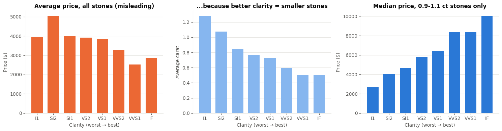
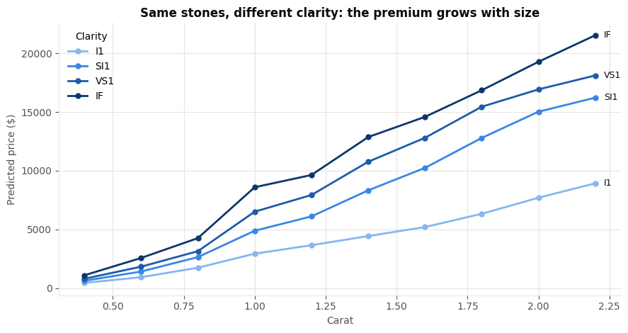
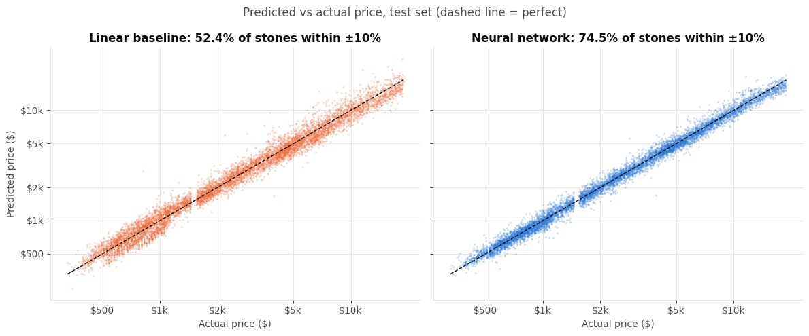
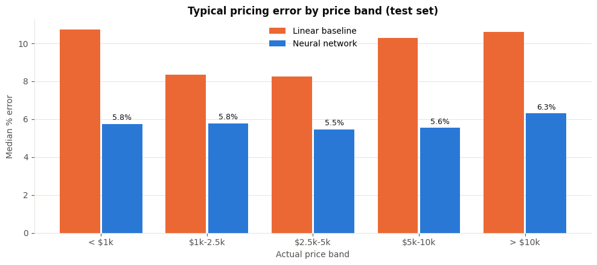

# 💎 Diamond Pricing Engine: a Neural Network Built from Scratch in NumPy

Pricing 53,770 real diamonds with a neural network I implemented by hand. Every layer, the backpropagation, the Adam optimiser, feature scaling, data splitting, early stopping, the baseline model and every metric are written in NumPy.

## Headline results (8,065 held-out test diamonds)

| Metric | Linear baseline | **Neural network** |
|---|---|---|
| Average error per stone | $471 | **$296** (37% lower) |
| Typical (median) % error | 9.4% | **5.7%** |
| Stones priced within ±10% | 52.4% | **74.5%** |
| R² | 0.950 | **0.980** |
| Total pricing error across the test set | $3.80M | **$2.38M** ($1.42M less) |

## The business problem

A diamond retailer has to price thousands of stones. Pricing by hand is slow and inconsistent; stones priced too low give away margin, and stones priced too high sit unsold. This project builds a model that learns the market's pricing logic from past sales, then uses it for:

1. **An instant quote tool:** enter carat, cut, colour and clarity, get a price with a typical error band.
2. **A mispricing audit list:** flag stones whose price is more than 30% away from the model's estimate, so staff know where to look first.

## Why a neural network? The data is strongly nonlinear

- Price grows **much faster than size**, with premium jumps at "round" weights (1.0, 1.5, 2.0 carat).
- Grades **interact with size**: a clarity upgrade is worth a few hundred dollars on a small stone and thousands on a large one.
- Raw averages are **misleading**: the best clarity grades have some of the *lowest* average prices, only because they tend to be smaller stones.



The network learns these curved, interacting effects; the linear model cannot.





The network's error stays flat at about 5.5-6.3% across every price band, while the linear model's reaches 10-11% at both ends of the market.



## What's implemented from scratch

| Component | Details |
|---|---|
| `Dense` layer | forward pass, backpropagation, He initialisation |
| Activations | ReLU and linear, with derivatives |
| `Adam` optimiser | first and second moment estimates with bias correction |
| Training loop | mini-batches, per-epoch shuffling, step learning-rate decay, early stopping with best-weight restore |
| **Gradient check** | finite-difference verification of backprop (relative error ~1e-11) |
| Preprocessing | ordinal encoding, `StandardScaler`, train / validation / test split (70/15/15), fitted on training data only |
| Baseline | linear regression via closed-form least squares (`np.linalg.lstsq`) |
| Evaluation | MAE, RMSE, R², MAPE, median % error, % within ±10%, error by price band |
| Explainability | grouped permutation importance, "what-if" analysis by clarity grade |
| Deployment | model weights and scaler statistics saved to `.npz` and reloaded |

**Architecture:** 9 inputs → 64 → 64 → 32 → 1 (ReLU hidden layers, linear output), 6,913 parameters, trained on log(price). Training takes about 17 seconds on a laptop CPU.

## Project structure

```
diamond-pricing-ann/
├── diamond_pricing_ann.ipynb   # full analysis, model and results
├── diamonds.csv                # dataset (53,940 rows before cleaning)
├── diamond_pricing_model.npz   # trained weights + scaler statistics
├── images/                     # charts used in this README
└── requirements.txt
```

## How to run

```bash
pip install -r requirements.txt
jupyter notebook diamond_pricing_ann.ipynb
```

Then run all cells (Kernel → Restart & Run All). Results are reproducible with the fixed random seeds.

## Data

The *Diamonds* dataset, published with the ggplot2 R package and mirrored in [seaborn-data](https://github.com/mwaskom/seaborn-data). It covers 53,940 round-cut diamonds with price in USD. Cleaning removed 20 stones with a zero dimension, 5 with impossible dimensions and 145 exact duplicates, leaving 53,770.

## Limitations 
- Prices are historical, not current market prices; a production version would retrain on recent sales.
- Missing value drivers: fluorescence, certification lab, shape, natural vs lab-grown.
- The error band is a typical (median) error, not a formal prediction interval. A next step would be an ensemble of networks to produce proper intervals.
- Benchmark against gradient-boosted trees, and wrap the quote tool in a small web API.
